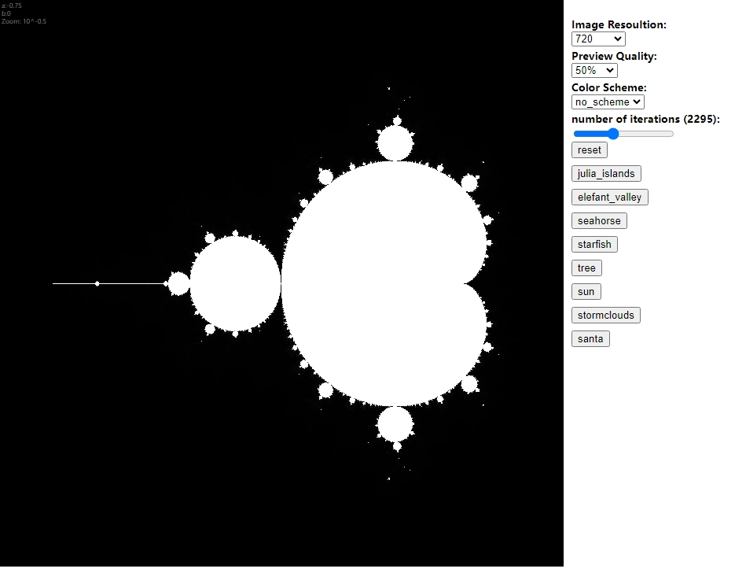

# Tut-07_Group-D_jzha0529

## 1. Interation

Click to play button and wait for the music to start, and control the volume by scrolling the slider.

## 2. individual approach

Audio frequency to animate the __line length__ and __weight__ of the image.

## 3. Inspiration

Although this image has less to do with the image of our group, I noticed the slider. it comes to my mind that in my individual part I could control the volume with the slider, which would be more precise than controlling it with mouse movements.

## 4. Technical explanation

> Create a class called Audio and in it create functions on button, play/pause, slider and volume.

> Use the value() function to correspond the volume to the slider.

> Initialise fft, button and slider.

> Get the average frequency of the music in createLines() in the group code.

> Create audioLength and audioLength2 variables and use the map() method to control how much the line length changes.

> Attach the variables to the corresponding length and weight properties in the line.

